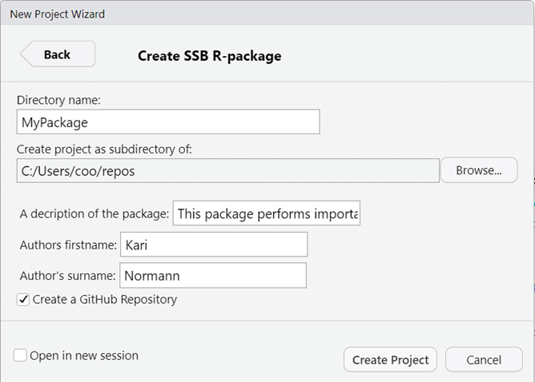

# SSB mal for R-pakker

## Hvorfor bygge en R-pakke?

R pakker er en god måte å dele koden din med andre. Gjenbruk av kode er
et av de grunnleggende
[IT-arkitekturprinsipper](https://statistics-norway.atlassian.net/wiki/spaces/Arkitektur/pages/3538714625/Arkitekturprinsipper)
vi bruker i SSB. Utvikling av R-pakker er et positiv bidrag til dette.
Koden blir dokumentert på en standardisert måte og det kan lett deles
med andre internt og eksternt. Det er gode løsninger for avhengighet
mellom pakker og funksjoner i ulike pakker. Hovedårsakene for å bygge
R-pakker:

- Lett å delekode med andre
- Organisere arbeid
- Dokumentasjon for både deg selv og andre

Desverre kan det være et høyt terskel til å bygge en pakke, særlig hvis
du ikke har gjort dette før. Gruppen Kvalitet i kode og kode (KVAKK) har
satt opp noen [krav og anbefalinger til pakker som lages i
SSB](https://statistics-norway.atlassian.net/wiki/spaces/BEST/pages/3569778806/Regler+og+anbefalinger+for+gjenbruk#Biblioteker).
Det går på ting som navnestandard, dokumentasjon og testing. For å gjøre
det lettere å følge har KVAKK utviklet et mal som kan brukes for å
opprette strukturen for en R-pakke som følge SSB standarder på en lett
måte.

## Hvordan bruke SSBs mal for R-pakker?

### Før du starte

Vi anbefaler å bruke **RStudio** til å lage R-pakker.

Mal for SSB pakker er inkluderte i SSBs `fellesr` pakke. **Sjekk at du
har installerte fellesr** fra før ved å skrive

``` r
library(fellesr)
```

Hvis ikke det er installert følg instruk [på fellesr siden på
github](https://github.com/statisticsnorway/fellesr?tab=readme-ov-file#fellesfunksjoner-i-r-for-ssb-fellesr)

SSBs mal for R-pakke sette opp et github repository på Statisticsnorway
område. Noen av prosesser for å sette opp repoen kreve både “repo” og
“workflow”. **Sjekk at tokenet ditt har workflow og repo scope** ved å
logge inn på GitHub, klikk på ikonet ditt oppe til høyre, velg Settings,
Developer settings (helt nederst til venstre), Personal access tokens og
Tokens(classic). Hvis tokenet ditt mangler et av scopene så lager du et
nytt token som [beskrevet i
Dapla-manualen](https://manual.dapla.ssb.no/git-og-github.html#sec-pat).

### Start et nytt prosjekt for pakken

For å starte et nytt prosjekt for pakken din, velg File \> New Project…
\> New Directory.

Det skal åpnes et vindu hvor du kan da velge “SSB R-package”. Velg
dette. 

Gi pakken din et navn (ingen mellomrom eller bindestrekk) og fyll inn en
beskrivelse, og navn ditt. Klikk på “Create project” for å opprette
pakken.



Picture of Create SSB R-package options

En mappe opprettes på område du har valgt å starte prosjektet men med
“ssb-” på foran. Dette er for å fylle navn-standard i SSB. HVis du velge
å opprette et github repository (anbefalt for å kunne dele med andre)
vil det spøres om github brukernavn og github token. Github token må ha
workflow rettigheter for å kunne opprette alle filene. Følge prosessen
videre og godkjenne endringer til README filene som anbefalt.

### Hva er alle filene?

Etter du har kommet gjennom prosessen av å opprette mal for pakken din
vil du se at det er mange filer inn i mappen. Hovedkomponenter er:

- `R/` mappe hvor R-kode skal ligge.
- `man/` mappe hvor beskrivelsen av funksjoner skal lagres.
- `data/` mappe hvor test/syntetiske data kan lagres. Dette er ikke for
  ekte data.
- `tests/` mappe som inneholder enhetstester for funksjoner i pakken.
- En `DESCRIPTION` fil, som gi en generell beskrivelsen av pakken.
- En `NAMESPACE` fil, som forklarer hvordan pakken og funksjoner skal
  kommunisere med andre pakker.

Andre filer som opprettes inkludere en Rstudio prosjekt fil,
`pkgname.Rproj`, en `.buildignore` fil som si hva skal ikke
inkluderes/deles videre i mappen, og SSB standard lisens og sikkerhet
filer.

Ved å sette opp en github repo til pakken blir det opprettet en .git
mappe til git filene og .github mappen som inkkludere filer for
automatiske testing og bygging av dokumentasjon.

Filen `News.md` inkludere informasjon til de som skal bruke pakken din
om endringer i versjoner hvis du utvikle pakken videre.

### Legg inn egen kode

Funksjoner kan nå flyttes inn til mappen som heter R/. Det er anbefalt å
dokumentere funksjoner ved roxygen2. Da kan du gi funksjoner et navn og
beskrivelsen i tillegg til å spesifisere parameter og det som
returneres. Det er alltid god praksis å lage noen enkel eksempler som
viser hvordan funksjoner fungere. Mer om dokumentasjon av koden ved
roxygen2 finner du under [Object
documentation](https://r-pkgs.org/man.html).

### Redigere DESCRIPTION-fil

`DESCRIPTION` filen er en viktig fil som sier noen generelt om pakken du
lager. Det inkluderer navn av pakken, beskrivelsen og hvem som har
skrevet det. Navn av pakken må ikke inkludere “-” eller mellomrom og kan
være ulik reponavn som sannsynligvis inkludere “ssb-”. Description filen
kan åpnes og redigeres direkte i RStudio. Filen også inkludere
informasjon om hvike andre pakker trengs for å kunne kjøre koden din.
Endre dette etter behov. Mer detaljer om DESCRIPTION filen finner du
[her](https://r-pkgs.org/description.html)

### Testing

Det er viktig å lage noen tester (enhetstester) til funksjoner i pakken
din. Dette kan bidra til færre bugs og bedre struktur i koden. Pakken
[testthat](https://testthat.r-lib.org) gi et rammeverk for å lage og
kjøre tester. En typisk test er å sjekke at en funksjon returnere en
forventet verdi.

Koden for tester skal ligger i .R filer og skal ligge i pakken under
[/tests/testthat/](https://r-pkgs.org/tests.html#test-organisation).Filnavn
skal starte med `test`. I tillegg til fil(ene) som inneholder tester
skal det være en fil som heter `testthat.R`. Dette lagres i mappen
`/tests/` og gir instruks om det som skal testes. Mer informajson om
testing finner du i [kapittel 12](https://r-pkgs.org/tests.html).

## Dele pakken med andre

### Pull request og merge

Når du har flyttet inn koden din til mappen som ble oprettet ved SSB mal
kan du commit og push endringer til github. Logg inn på repoet på GitHub
og opprett en pull-request. Vent med å legge til Reviewers til du ser at
alle sjekker er “grønne”. Noen av testene kjøres først når du oppretter
en pull-request, slik som kjøring av tester med forskjellige
R-versjoner. Det er greit å sjekke at alt dette går gjennom før du ber
noen se på koden, slik at de slipper å se på den flere ganger.

Når pull requesten er godkjent, så merger du den og sletter branchen.
Pakken blir da “publisert” til Github og er tilgjengelig for
installering av andre
(`devtools::install_github("statisticsnorway/ssb-minpakke")`).
Dokumentasjonen vil blir automatisk publiserte til GitHub Pages. Linken
til dokumentasjonen er: statisticsnorway.github.io/. Sjekk at
dokumentasjon ser ut som forventet.

### Konfigurering av GitHub-repo

SSBs mal for R-pakker opprette repo som intern. Men det mye lettere å
installere public pakker fra github. Det settes en del krav til hvordan
et public GitHub repo i SSB skal være konfigurert [se
ADR0006](https://github.com/statisticsnorway/adr/blob/main/docs/0006-aapen-kildekode-i-ssb.md#kriterier-for-%C3%A5pen-kildekode).
Sørg for at disse er oppfylt. Se [beskrivelse av hvordan konfigurere et
GitHub-repo](https://statistics-norway.atlassian.net/wiki/spaces/BEST/pages/3092709381/Hvordan+opprette+nytt+GitHub-repo#Konfigurere-repo)
for detaljer, og legg til hvem som skal ha tilgang til repoet.

Send en e-post til <sikkerhetssenter@ssb.no> og be om at repoet gjøres
public.

Etter at repoet er public, gjennomfør resterende konfigurasjon som
beskrevet på siden [hvordan konfigurere et public GitHub-repo for
biblioteker](https://statistics-norway.atlassian.net/wiki/spaces/BEST/pages/3580428373/Hvordan+konfigurere+et+public+GitHub-repo+for+biblioteker).

### Lag en release

Release gjøre det enklere å kontrollere versjoner av pakken din senere.
Det betyr at de som bruker pakkenn din kan installere eldre versjoner av
pakke på en lett måte. Dette kan du gjøre fra Github ved å trykke på
“Create a new release”. Release title er vanligvis versjonsnummer for
eks. “v1.0.0”.
