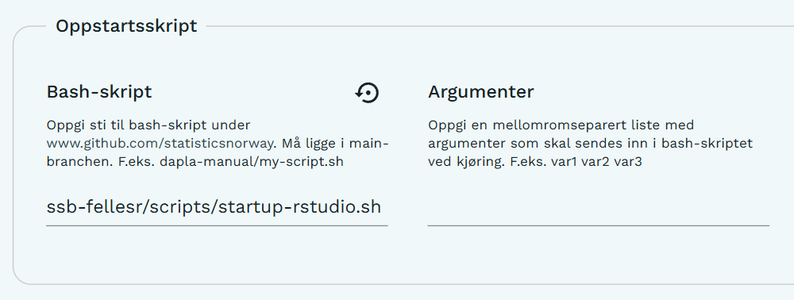

---
title: "Hvordan ta i bruk oppstartsskript for RStudio i Dapla Lab"
author: "Sindre Mikael Haugen"
date: "`r Sys.Date()`"
output: rmarkdown::html_vignette
vignette: >
  %\VignetteIndexEntry{{Hvordan ta i bruk oppstartsskript for RStudio i Dapla Lab}
  %\VignetteEngine{knitr::rmarkdown}
  %\VignetteEncoding{UTF-8}
---

```{r setup, include = FALSE}
knitr::opts_chunk$set(
  collapse = TRUE,
  comment = "#>"
)
```


Dapla Lab støtter bruk av egne Bash-skript som kjøres automatisk når en
tjeneste starter. Se
[Dapla-manualen](https://manual.dapla.ssb.no/news/posts/2025-06-23-startup-script/index.html)
for generell informasjon om oppstartsskript. Denne veiledningen viser hvordan
oppstartsskriptet for RStudio i `ssb-fellesr` tas i bruk.

Oppstartsskriptet kan brukes for å klargjøre et R-prosjekt automatisk når en
RStudio-tjeneste startes i Dapla Lab. Skriptet finner Git-repoet som er valgt i
Dapla Lab, setter dette som arbeidsmappe og gjenoppretter prosjektets
`renv`-miljø fra `renv.lock`. Dersom repoet inneholder en `.Rproj`-fil med
samme navn som repoet, åpnes prosjektet automatisk i RStudio.

Kort oppsummert blir alle pakkene i R-prosjektet installert før tjenesten
startes, og prosjektfilen åpnes automatisk ved oppstart.

## 1. Velg Git-repoet du skal arbeide med

I konfigurasjonen av RStudio-tjenesten må **Git repository** være satt til
repoet du ønsker å arbeide i. Oppstartsskriptet bruker denne innstillingen
(`GIT_REPOSITORY`) til å finne navnet og plasseringen til prosjektet.

## 2. Legg inn oppstartsskriptet

Gå til **Avansert → Oppstartsskript** og legg til følgende under
**Bash-skript**:
  
  ```text
ssb-fellesr/scripts/startup-rstudio.sh
```

Feltet **Argumenter** kan stå tomt. Skriptet bruker per i dag ingen
argumenter.

```{r, echo = FALSE, out.width="100%"}

```

## 3. Start RStudio-tjenesten

Ved oppstart vil skriptet blant annet:
  
  - sette repoet som standard arbeidsmappe
- aktivere `renv` og kjøre `renv::restore()` fra prosjektets `renv.lock`
- åpne `<repo-navn>.Rproj` automatisk ved oppstart dersom filen finnes

For å få fullt utbytte av oppstartsskriptet anbefales det derfor at repoet
inneholder:
  
  ```text
renv.lock
<repo-navn>.Rproj
```

`renv.lock` sørger for at riktige pakkeversjoner installeres. `.Rproj`-filen
er valgfri, men gjør at prosjektet åpnes automatisk når RStudio starter.

Skriptet legger også inn kode for automatisk åpning av RStudio-prosjektet i
`.Rprofile`. Denne koden legges bare til dersom `rstudioapi::openProject`
ikke allerede finnes i filen, slik at den ikke legges til på nytt hver gang
tjenesten startes.

## 4. Feilsøking

Dersom noe går galt under oppstart, kan du se i loggfilene som opprettes i
`/home/onyxia/`.

Oppstartsskript og andre oppstartsprosesser skriver informasjon om hva som har
blitt kjørt, og eventuelle feilmeldinger, til loggfiler i denne mappen. Disse
er ofte det beste stedet å starte dersom prosjektfilen ikke åpner som forventet
eller pakkeinstallasjon/`renv::restore()` feiler.

De to viktigste loggfilene er:
  
  - `personal_init_script.log` – inneholder output fra oppstartsskriptet som er
konfigurert i Dapla Lab. Her kan du se hvilke kommandoer som ble kjørt og
eventuelle feilmeldinger fra selve oppstartsskriptet.
- `renv-startup.log` – inneholder logging fra `renv`-delen av oppstarten. Her
vil du typisk finne informasjon om aktivering av `renv`, `renv::restore()`,
installasjon av pakker og eventuelle feil knyttet til `renv.lock` eller
pakkeinstallasjon.

Du kan for eksempel lese loggene fra terminalen med:
  
```bash
cat /home/onyxia/personal_init_script.log
```

```bash
cat /home/onyxia/renv-startup.log
```

## 5. Personlige oppstartsskript

Oppstartsskriptet i `ssb-fellesr` er ment som et minimalt og felles
utgangspunkt for RStudio i Dapla Lab, og anbefales for brukere som først og
fremst ønsker automatisk oppsett av R-prosjektet og `renv`-miljøet.

Det er samtidig mulig å lage et eget oppstartsskript dersom du ønsker å
tilpasse tjenesten ytterligere. Du kan enten kopiere oppsettet fra
`ssb-fellesr` og bygge videre på dette, eller lage et helt eget Bash-skript.

Et oppstartsskript kan i utgangspunktet brukes til å automatisere oppgaver som
du ellers måtte gjort manuelt etter at tjenesten har startet. Et personlig
oppstartsskript kan for eksempel brukes til å:

- endre tema og andre innstillinger i RStudio eller JupyterLab
- sette opp egne hurtigtaster, aliaser eller miljøvariabler
- laste ned flere Github-repoer automatisk
- installere Python-pakker eller andre avhengigheter
- konfigurere Java eller andre programmer som brukes fra R
- gjøre andre tilpasninger av arbeidsmiljøet

Du kan ta utgangspunkt i
[`startup-rstudio.sh`](https://github.com/statisticsnorway/ssb-fellesr/blob/main/scripts/startup-rstudio.sh)
og kopiere relevante deler til ditt eget skript.

For å bruke et eget oppstartsskript må skriptet ligge i `main`-branchen i et
repo under `github.com/statisticsnorway`. I tjenestekonfigurasjonen i Dapla Lab
angir du deretter stien til skriptet under **Avansert → Oppstartsskript**.

Hvis skriptet for eksempel ligger her:

```text
https://github.com/statisticsnorway/mitt-repo/blob/main/scripts/startup-rstudio.sh
```

skal følgende legges inn under **Bash-skript**:

```text
mitt-repo/scripts/startup-rstudio.sh
```

### Eksempler til inspirasjon

Følgende kan brukes som eksempler på hva oppstartsskript kan inneholde:

- [Oppstartsskript til Øyvind I. Berntsen](https://github.com/statisticsnorway/yib-settings/blob/main/rstudio/rstudio-init.sh)
- [Oppstartsskript for å justere Java-versjon (sj-pickmdl3)](https://github.com/statisticsnorway/sj-pickmdl3-testing/blob/main/oppstart_test.sh)

De personlige eksempelskriptene er kun ment som inspirasjon. De er ikke
felles oppstartsskript som anbefales brukt direkte, og innholdet kan endres av
eieren uten varsel. Kopier derfor heller relevante deler til ditt eget
oppstartsskript og tilpass dem til behovene i prosjektet ditt.