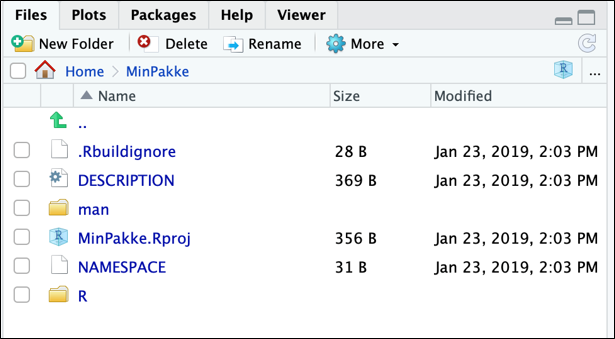

```{r setup, include=FALSE}
knitr::opts_chunk$set(echo = TRUE, warning = FALSE, message = FALSE, eval = FALSE)

#### Links to images need to be images/filname for it to render on github!!
```

## Hvorfor bygge en R-pakke?
Har du en laget en funksjon som du tror andre kan få nytte av? Den beste løsning for å dele funksjoner i R med andre er å lage en pakke. Koden blir dokumentert på en standardisert måte og det kan lett deles med andre internt og eksternt. Det er gode løsninger for avhengighet mellom pakker og funksjoner i ulike pakker. Hovedårsakene for å bygge R-pakker:

* Lett å dele og flytte
* Organisere arbeid
* Dokumentasjon for både deg selv og andre

[R Packages](https://r-pkgs.org/index.html) skrevet av Hadley Wickham er en veldig god referanse for pakke-bygging. Denne bloggen gir en kort intro og referere til forkjellige uvsnitt i boken for videre lesing.


## Teknisk oppsett
Det er anbefalt å bygge R-pakke i RStudio. Det er lettest å gjøre dette i admin/på PC eller på linux. På linux er alle nødvendig tilleggsverktøy og pakker installerte.

For å bygge en pakke i admin/på PC:

 - Installere [R](https://www.r-project.org/) og [RStudio](https://www.rstudio.com/products/rstudio/) hvis ikke du har gjort dette tidligere. Søk om admin tilgang til PCen din om nødvendig. 
 - Installere [git](https://git-scm.com/). Dette er verktøy vi bruker for å dele pakken etterpå. 
 - Det er anbefalte å installere [Rtools](https://cran.r-project.org/bin/windows/Rtools/rtools40.html), særlig hvis koden inkluderer C, C++ eller Fortran kode.
 - Hvis du vil bygge pdf-hjelp filene selv trenger du å installere en LaTeX verktøy for eks. [MikTex](https://miktex.org/download)

Det er fem nyttige R-pakker som gjøre pakke bygging prosessen lettere. Disse kan installeres ved:

```{r}
install.packages(c("devtools", "roxygen2", "testthat", "usethis", "knitr"))
```

Endelig kan du sjekke om systemet er klar for å bygge en pakke ved å kjøre:

```{r}
library(devtools)
has_devel()
```


## Bygge pakke-struktur
R-pakker har en standard struktur som må følges. For å bygge alle nødvendig filer kan du kjøre:

```{r}
library(usethis)
create_package("~/path/to/minpakke")
```

Dette  oppretter noen mapper og filer og vil ligne på dette



Hovedkomponenter er:

 - `R/`  mappe hvor R-kode skal ligge.
 - `man/`  mappe hvor beskrivelsen av funksjoner skal lagres.
 - En `DESCRIPTION` fil, som gi en generell beskrivelsen av pakken.
 - En `NAMESPACE` fil, som forklarer hvordan pakken og funksjoner skal kommunisere med andre pakker.
 - Når man lage en pakke, opprettes det en Rstudio prosjekt fil, `pkgname.Rproj` og en `.buildignore` fil.

## DESCRIPTION-fil
`DESCRIPTION` filen sier noen generelt om pakken du lager. Det inkluderer navn av pakken, beskrivelsen og hvem som har skrevet det. Denne filen kan åpnes og redigeres direkte i RStudio. For eksempel:


Mer detaljer om DESCRIPTION filen finner du [her](https://r-pkgs.org/description.html) 


## Dokumentasjon av kode/funksjoner
Funksjoner skal ligger som .R filer og skal flytte inn i mappen som heter R/. Det er anbefalt å dokumentere funksjoner ved roxygen2. Da kan du gi funksjoner et navn og beskrivelsen i tillegg til å spesifisere parameter og det som returneres. Det er alltid god praksis å lage noen enkel eksempler som viser hvordan funksjoner fungere. Mer om dokumentasjon av koden ved roxygen2 finner du under [Object documentation](https://r-pkgs.org/man.html).

## Andre filer
Det er mye annet som kan inkludere i en pakke. For eksempel kan det være nyttig til å inkludere noen små datasett til eksempler og testing. Disse skal være syntetiske data eller offentlig datasett. Mer om å inkludere data i pakken din finner du [her](https://r-pkgs.org/data.html).


## Testing
Det er ikke strengt nødvendig å lage noen formelle tester (enhetstester) til funksjoner i en pakke men det er anbefalt. Det kan ofte bidra til færre bugs og bedre struktur i koden. Pakken [testthat](https://testthat.r-lib.org) gi et rammeverk for å lage og kjøre tester. En typisk test er å sjekke at en funksjon returnere en forventet verdi. For eksempel kan vi bruke vectoren `x` nede for å teste at funksjonen `mean` returnerer den riktige verdien:

```{r, warnings=FALSE}
x <- c(3, 4, 5)
test_that("The function mean returns a correct value",{
  expect_equal(mean(x), 4)
})
```

Her bruker vi `expect_equal` og gir to verdier som vi forventer er like. Mer hjelp og eksempler for tester ligger [her](https://r-pkgs.org/tests.html#expectations).

Koden for tester skal ligger i .R filer og skal ligge i pakken under [/tests/testthat/](https://r-pkgs.org/tests.html#test-organisation).Filnavn skal starte med `test`. I tillegg til fil(ene) som inneholder tester skal det være en fil som heter `testthat.R`. Dette lagres i mappen `/tests/` og gir instruks om det som skal testes. For eksempel vil det vanligvis ligne på dette:


```{r}
library(testthat)
library(minpakke)

test_check("minpakke")
```

Mer informajson om testing finner du i [kapittel 12](https://r-pkgs.org/tests.html).


## Dele med andre ved git
Git er et verktøy for å versjonskontrollere kode og for å dele med andre. Ved å legge pakken din på git betyr det at andre kan installere pakken selv. Generelle informasjon om git i SSB finner du på [Byrånettet](https://ssbno.sharepoint.com/sites/Kompetanseogutvikling/SitePages/Git-i-SSB.aspx). Mye informasjon om git og R finner i [Happy Git and Gihub for the useR](https://happygitwithr.com/index.html).

Noen filer vil du inkludere på github/bitbucket men ikke i pakken din når det bygges. Dette kan være, for eksempel, noen kjørekode som brukes under utvikling/testing. En 
[.Rbuildignore](https://r-pkgs.org/package-structure-state.html?q=buildignore#rbuildignore)-fil kan inkluderes i git repo for å spesifisere hvilke filer ikke skal  bygges inn i pakken.


## Automatisere testing med github actions
Github Actions er en måte å automatisering testing av pakken din. Det kjøres tester om pakken kan bygges og om alle enhetstester godkjennes for hver gang none endringer blir pushe opp til github (for eksempel). Det kan også teste funksjonene fine på forskjellige OS og på forskjellige versjoner av R. Et eksempel av en pakke med tester og github actions er klassR som ligger ut på github. Her kan du se litt på workflows mappen og filene som kreves for å kjøre disse automatiserte tester. 

Mer informasjon om hvordan å sette opp github action for R finner på [Github Actions with R](https://orchid00.github.io/actions_sandbox/index.html#what-are-github-actions) og/ eller på [r-lib](https://github.com/r-lib/actions).


## Sitte fast?
Hvis du sitter fast med et problem med pakke bygging er det veldig sannsynlig at andre på SSB har hatt det samme problemet. Ta gjerne kontakt med andre på [Yammer](https://www.yammer.com/ssb.no/#/threads/inGroup?type=in_group&feedId=9481952) 


